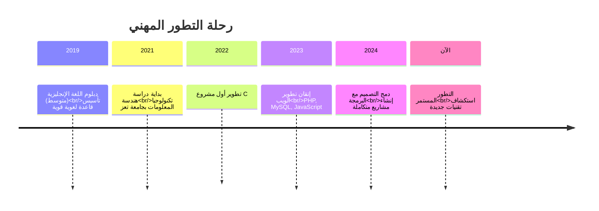

<!-- Header Section with Animated Waves -->
<p align="center">
  
</p>

<!-- Main Title -->
<div align="center">
  
#  مطور برمجيات | يجمع بين قوة التقنية ولمسة الإبداع
### تحويل الأفكار الرقمية إلى واقع ملموس

جامع بين البرمجة المتقنة والتصميم الإبداعي |  شغوف بالابتكار التقني |  ملتزم بجودة عالية في كل سطر أكواد

</div>

---

<!-- Personal Introduction -->
<div align="center" style="background: linear-gradient(135deg, #1a2980, #26d0ce); padding: 25px; border-radius: 15px; margin: 20px 0;">

###  رحلتي التقنية

لؤي سيف، مطور ويب متكامل من اليمن، أدرس هندسة تكنولوجيا المعلومات في جامعة تعز.  
أجمع بين **الدقة التقنية للبرمجة** و**الجمالية الفنية للتصميم** لإنشاء حلول رقمية مبتكرة.  
أؤمن بأن كل مشروع تقني هو قصة تحتاج إلى سرد مميز، وكل سطر كود هو لبنة في بناء المستقبل الرقمي.

</div>

---

<!-- Skills Matrix -->
<div align="center">

## مهاراتي التقنية

### 💻 لغات البرمجة والتطوير


### 🌐 تطوير الويب والأدوات


### 🗄️ قواعد البيانات والخوادم


### 🎨 التصميم والإبداع


</div>

---

<!-- Statistics Dashboard -->
<div align="center">


</td>
<td width="33%">

⭐ الإنجازات

```diff
+ المشاريع النشطة: 6
+ النجوم: 18 ⭐
+ المساهمات: 47
```

</td>
<td width="33%">

📈 التقدم

```diff
+ البرمجة: 85% ████████░░
+ التصميم: 75% ███████░░░
+ الإبداع: 90% █████████░
```

</td>
</tr>
</table>

</div>


<div align="center">

🎓 مسيرتي التعليمية والتطويرية



</div>

 <!-- Contact Information -->
<div align="center">

## 

### معلومات التواصل الرسمية

<table>
<tr>
<td width="50%">

### **📍 المعلومات الشخصية**
**الاسم الكامل:** لؤي محمد محمد سيف  
**الجنسية:** يمني  
**المدينة:** تعز، اليمن  
**التعليم:** بكالوريوس هندسة تكنولوجيا المعلومات (جاري)  
**الجامعة:** جامعة تعز

</td>
<td width="50%">

### **📞 قنوات التواصل المباشرة**
[](mailto:loiysife7890@gmail.com)
[](https://wa.me/967778072825)
[](https://github.com/loay-sife)

</td>
</tr>
</table>

### **🌐 الشبكات المهنية**
[](https://linkedin.com/in/loay-sife)
[](https://twitter.com/loay_sife)
[](https://loay-sife.github.io/portfolio)

</div>
<!-- Footer & Final Touches -->

<div align="center">


<p align="center">
  
</p>
</div>
