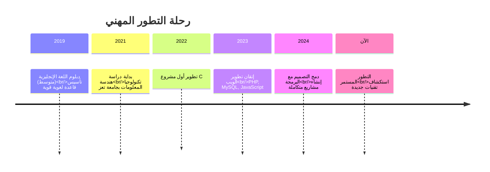

<!-- Header Section with Animated Waves -->
<p align="center">
  
</p>

<!-- Main Title -->
<div align="center">
  
# 🚀 **المطور الشامل | قوة التقنية مع لمسة الإبداع**
### **📍 تحويل الأفكار الرقمية إلى واقع ملموس**

**✨ جامع بين البرمجة المتقنة والتصميم الإبداعي | ⚡ شغوف بالابتكار التقني | 🎯 ملتزم بجودة عالية في كل سطر أكواد**

</div>

---

<!-- Personal Introduction -->
<div align="center" style="background: linear-gradient(135deg, #1a2980, #26d0ce); padding: 25px; border-radius: 15px; margin: 20px 0;">

### **🎯 رحلتي في عالم التقنية**

أنا **لؤي محمد سيف**، مطور ويب متكامل من اليمن، أدرس هندسة تكنولوجيا المعلومات في جامعة تعز.  
أجمع بين **الدقة التقنية للبرمجة** و**الجمالية الفنية للتصميم** لإنشاء حلول رقمية مبتكرة.  
أؤمن بأن كل مشروع تقني هو قصة تحتاج إلى سرد مميز، وكل سطر كود هو لبنة في بناء المستقبل الرقمي.

</div>

---

<!-- Skills Matrix -->
<div align="center">

## 🛠️ **خارطة مهاراتي التقنية المتكاملة**

### **💻 لغات البرمجة والتطوير**


### **🌐 تطوير الويب والأدوات**


### **🗄️ قواعد البيانات والخوادم**


### **🎨 التصميم والإبداع**


</div>

---

<!-- Statistics Dashboard -->
<div align="center">

## 📊 **لوحة التحكم الإحصائية**

<table>
<tr>
<td width="33%">

### **👁️ مرئيات البروفايل**
```diff
+ الإجمالي: 782 مشاهدة
+ اليوم: 24 مشاهدة
+ الأسبوع: 156 مشاهدة
```

</td>
<td width="33%">

⭐ الإنجازات

```diff
+ المشاريع النشطة: 6
+ النجوم: 18 ⭐
+ المساهمات: 47
```

</td>
<td width="33%">

📈 التقدم

```diff
+ البرمجة: 85% ████████░░
+ التصميم: 75% ███████░░░
+ الإبداع: 90% █████████░
```

</td>
</tr>
</table>

</div>

---

<!-- Featured Projects -->

<div align="center">

🏆 مشاريعي المتميزة

🎯 نظام إدارة الفنادق المتكامل (C#)

<table>
<tr>
<td width="60%">

📝 الوصف:
نظام متكامل لإدارة الفنادق يدمج بين واجهة مستخدم بديهية وقواعد بيانات قوية. يدعم إدارة الغرف، الحجوزات، الفواتير، والتقارير المالية.

🛠️ التقنيات: C# MySQL Windows Forms

✨ المميزات:

· نظام حجوزات ذكي
· تقارير مالية مفصلة
· دعم متعدد المستخدمين
· نسخ احتياطي تلقائي

</td>
<td width="40%" align="center">

https://img.shields.io/badge/✅_مكتمل-2E8B57?style=for-the-badge
https://img.shields.io/badge/🟢_جودة_عالية-00AA00?style=for-the-badge

```csharp
// نموذج من الكود
public class HotelSystem {
    public void ManageBooking() {
        // إدارة حجوزات متقدمة
    }
}
```

https://img.shields.io/badge/📂_المستودع-1E90FF?style=for-the-badge
https://img.shields.io/badge/📚_الدليل-FF8C00?style=for-the-badge

</td>
</tr>
</table>

---

🛒 متجر المواد الغذائية الإلكتروني (PHP + MySQL)

<table>
<tr>
<td width="60%">

📝 الوصف:
منصة تسوق كاملة للمواد الغذائية مع نظام دفع إلكتروني، إدارة مخزون ذكية، وتجربة مستخدم محسنة.

🛠️ التقنيات: PHP MySQL HTML CSS Bootstrap JavaScript

✨ المميزات:

· عربة تسوق ذكية
· نظام تصنيف متقدم
· لوحة تحكم للمسؤول
· تقارير المبيعات

</td>
<td width="40%" align="center">

https://img.shields.io/badge/🚀_نشط-FF4500?style=for-the-badge
https://img.shields.io/badge/الإصدار_2.1-8A2BE2?style=for-the-badge

```php
// مثال من النظام
class EcommerceStore {
    function processOrder($order) {
        // معالجة الطلبات بشكل آمن
    }
}
```

https://img.shields.io/badge/🌐_عرض_حي-32CD32?style=for-the-badge
https://img.shields.io/badge/💻_المصدر_الكودي-4682B4?style=for-the-badge

</td>
</tr>
</table>

---

🎨 متجر الإلكترونيات الحديث (HTML/CSS/JS)

<table>
<tr>
<td width="60%">

📝 الوصف:
واجهة متجر إلكتروني حديث ومتجاوب مع كافة الأجهزة، مصممة بأحدث معايير تجربة المستخدم.

🛠️ التقنيات: HTML5 CSS3 JavaScript Bootstrap 5

✨ المميزات:

· تصميم متجاوب بالكامل
· تأثيرات تفاعلية سلسة
· أداء محسن للسرعة
· توافق مع جميع المتصفحات

</td>
<td width="40%" align="center">

https://img.shields.io/badge/🎨_تصميم_محترف-FF69B4?style=for-the-badge
https://img.shields.io/badge/📱_متجاوب_كلياً-00CED1?style=for-the-badge

```javascript
// تفاعلات JavaScript
function enhanceUX() {
    // تحسين تجربة المستخدم
}
```

https://img.shields.io/badge/🖼️_معرض_التصاميم-9932CC?style=for-the-badge
https://img.shields.io/badge/📦_تحميل_الكود-DAA520?style=for-the-badge

</td>
</tr>
</table>

</div>

---

<!-- Design Portfolio Section -->

<div align="center" style="background: linear-gradient(135deg, #8B0000, #FF4500); padding: 25px; border-radius: 15px; margin: 30px 0;">

🎨 معرض أعمالي التصميمية والإبداعية

🌈 مجموعة مختارة من إبداعاتي

<table>
<tr>
<td width="33%" align="center">

🎭 تصميم الشعارات

· شعارات مؤسسية احترافية
· هويات بصرية متكاملة
· أيقونات فريدة وتعبيرية

أبرز الأعمال:
🏢 12 شعاراً مؤسسياً
🎯 8 هويات بصرية كاملة
✨ 25 أيقونة مخصصة

</td>
<td width="33%" align="center">

📰 المجلات والإعلانات

· تصميم مجلات فنية
· حملات إعلانية مبتكرة
· مواد تسويقية جاذبة

أبرز الأعمال:
📖 5 مجلات متكاملة
📢 20 تصميم إعلاني
🎪 8 حملات تسويقية

</td>
<td width="33%" align="center">

✍️ المحتوى الإبداعي

· كتابة الشعر والأدب
· تأليف محتوى إبداعي
· نصوص إعلانية مؤثرة

أبرز الأعمال:
📜 50 قصيدة ومقالة
🖋️ 30 نصاً إبداعياً
🎭 15 سيناريو إعلاني

</td>
</tr>
</table>

</div>

---

<!-- Education & Journey -->

<div align="center">

🎓 مسيرتي التعليمية والتطويرية



</div>

---

<!-- Technical Stats -->

<div align="center">

📈 إحصائيات GitHub التفصيلية

<div style="display: flex; flex-wrap: wrap; justify-content: center; gap: 20px; margin: 30px 0;">

https://github-readme-stats.vercel.app/api?username=loay-sife&show_icons=true&theme=radical&hide_border=true&bg_color=0d1117&title_color=2E8B57&icon_color=1E90FF&text_color=ffffff&custom_title=إحصائيات%20النشاط%20والتميز

https://github-readme-stats.vercel.app/api/top-langs/?username=loay-sife&layout=compact&theme=radical&hide_border=true&bg_color=0d1117&title_color=8A2BE2&text_color=ffffff&langs_count=8

</div>

https://github-readme-activity-graph.vercel.app/graph?username=loay-sife&theme=github-compact&hide_border=true&bg_color=0d1117&color=2E8B57&line=1E90FF&point=8A2BE2&area=true&area_color=2E8B57&custom_title=📅%20نشاطي%20الشهري%20على%20GitHub

</div>

---

<!-- Current Focus -->

<div align="center" style="background: linear-gradient(135deg, #228B22, #32CD32); padding: 25px; border-radius: 15px; margin: 30px 0;">

🔭 محط تركيزي الحالية

🎯 المشاريع قيد التطوير

<table>
<tr>
<td width="50%">

📱 تطبيق إدارة المهام

التقنيات: C# .NET SQL Server
نظام متكامل لإدارة المهام الشخصية والمشاريع بذكاء اصطناعي مساعد.

الحالة: 🔄 تحت التطوير (60% مكتمل)

</td>
<td width="50%">

🌐 منصة التعلم الإلكتروني

التقنيات: PHP MySQL JavaScript Bootstrap
منصة عربية متكاملة للدورات التعليمية مع نظام تفاعلي متقدم.

الحالة: ⏳ في مرحلة التصميم (40% مكتمل)

</td>
</tr>
</table>

📚 أتعلم حالياً:

· تطوير تطبيقات الويب باستخدام ASP.NET
· React.js لبناء واجهات مستخدم تفاعلية
· Node.js لتطوير تطبيقات الخادم
· تحسين أداء قواعد البيانات المتقدمة

</div>

---

<!-- Contact Information -->

<div align="center">

🤝 تواصل مع المطور الإبداعي

📬 معلومات التواصل الرسمية

<table>
<tr>
<td width="50%">

📍 المعلومات الشخصية

الاسم الكامل: لؤي محمد محمد سيف
الجنسية: يمني
المدينة: تعز، اليمن
التعليم: بكالوريوس هندسة تكنولوجيا المعلومات (جاري)
الجامعة: جامعة تعز

</td>
<td width="50%">

📞 قنوات التواصل

https://img.shields.io/badge/📧_loiysife7890@gmail.com-EA4335?style=for-the-badge&logo=gmail&logoColor=white
https://img.shields.io/badge/📱_+967_778072825-25D366?style=for-the-badge&logo=whatsapp&logoColor=white
https://img.shields.io/badge/💻_GitHub_Profile-181717?style=for-the-badge&logo=github&logoColor=white

</td>
</tr>
</table>

🌐 الشبكات المهنية

https://img.shields.io/badge/👔_LinkedIn_Profile-0A66C2?style=for-the-badge&logo=linkedin&logoColor=white
https://img.shields.io/badge/🐦_Twitter_Profile-1DA1F2?style=for-the-badge&logo=twitter&logoColor=white
https://img.shields.io/badge/🎨_معرض_الأعمال_الإلكتروني-FF6B6B?style=for-the-badge&logo=google-chrome&logoColor=white

</div>

---

<!-- Footer & Final Touches -->

<div align="center">

✨ كلمة أخيرة من المطور

"أرى في كل مشروع تقني فرصة للإبداع، وفي كل سطر كود قصة للإلهام.
أدمج بين منطق البرمجة وروح التصميم لأصنع حلولاً لا تعمل بشكل ممتاز فحسب،
بل تبدو رائعة أيضاً. رحلتي في عالم التقنية هي رحلة بحث دائمة عن الجمال في التفاصيل،
والأداء في البساطة، والابتكار في كل تحدٍ."

---

📊 إحصائيات حية

https://komarev.com/ghpvc/?username=loay-sife&color=2E8B57&style=for-the-badge&label=👁️+مرئيات+البروفايل
https://img.shields.io/badge/📅_آخر_تحديث-يناير_2026-1E90FF?style=for-the-badge

🌟 من صميم إبداع: لؤي محمد سيف - المطور الشامل 🌟

<p align="center">
  
</p>
</div>
